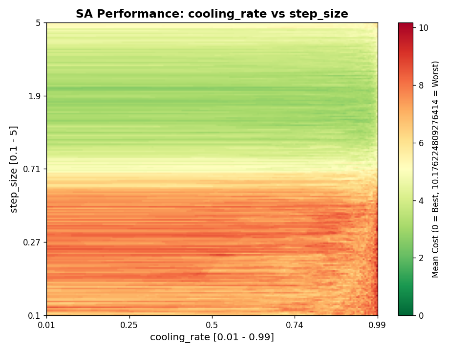

# Meta-Learning

**Proximal Policy Optimization (PPO)** is used to automatically tune **Simulated Annealing (SA)** hyperparameters.


### Visualisation of the hyperparameter space
<table>
  <tr>
    <td></td>
    <td></td>
    <td></td>
  </tr>
  <tr>
    <td></td>
    <td></td>
    <td></td>
  </tr>
</table>


More updates coming soon
- PPO to tune PPO?
- Other benchmarks, not just Rastrigin function
- Can we adjust the reward signal to not only perform well, but make the algorithm more efficient?


Python 3.12+

### Installation

```bash
# Install UV
pip install uv

# Install dependencies
uv sync

# Build Rust extension (optional, for better performance)
uv run maturin develop --release
uv sync
```

### Running Experiments

```bash
# Run PPO training to tune SA hyperparameters
python run_experiment.py

# Run grid search over SA hyperparameters
python run_grid_search.py
```

### Repo Structure

```
meta-learning/
├── run_experiment.py      # PPO training runner
├── run_grid_search.py     # Grid search runner
├── core/                  # Core implementation modules
│   ├── sa_algorithms/     # SA algorithm implementations
│   │   ├── python_serial.py   # Python serial SA
│   │   └── rust_parallel.py   # Rust parallel SA (fast)
│   ├── sa_config.py       # SA algorithm configuration
│   ├── tuning_env.py      # PPO training environment
│   └── ppo_agent.py       # PPO agent implementation
├── outputs/               # Generated plots and results
├── src/                   # Rust source code
│   └── lib.rs            # Rust SA implementation
└── README.md             # This file
```
