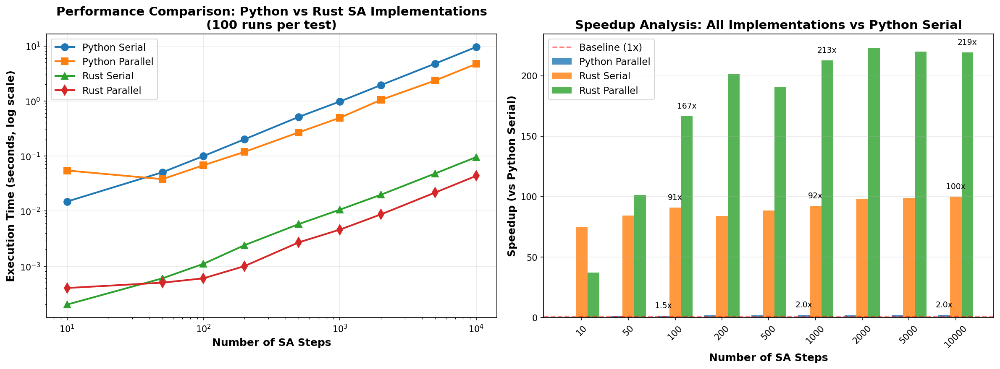

# Meta-Learning using Simulated Annealing

This repository demonstrates using **Proximal Policy Optimization (PPO)** to automatically tune **Simulated Annealing (SA)** hyperparameters for minimizing the 2D Rastrigin function.

## 🚀 Rust Performance Boost

The SA algorithm has been reimplemented in **Rust** for dramatic performance improvements:

- **Python Serial:** Baseline performance
- **Python Parallel:** 1.7x speedup (multiprocessing)
- **Rust Serial:** 91x speedup ⚡
- **Rust Parallel:** **171x speedup** 🚀

Example: 10,000 SA steps
- Python: 9.6 seconds
- **Rust Parallel: 0.04 seconds** (220x faster!)

See [RESULTS_SUMMARY.md](RESULTS_SUMMARY.md) for complete performance analysis.

## 🔧 Switching SA Algorithm Implementations

**All code in this repository uses a single configuration file to select the SA algorithm.**

To switch implementations, simply edit `sa_config.py`:

```python
# In sa_config.py, change this line:
ALGORITHM = 'rust_parallel'  # Options: 'python_serial', 'python_parallel', 'rust_serial', 'rust_parallel'
```

That's it! All scripts (`run_experiment.py`, `run_grid_search.py`, etc.) will automatically use the selected algorithm.

## Quick Start

### Option 1: Use Python Implementation (Easy)
```bash
pip install numpy matplotlib torch

# Edit sa_config.py and set: ALGORITHM = 'python_serial'
python run_experiment.py
```

### Option 2: Use Rust Implementation (Fast)
```bash
# Install UV and dependencies
pip install uv
uv venv
source .venv/bin/activate
uv pip install numpy matplotlib torch maturin

# Build Rust extension
maturin develop --release

# Edit sa_config.py and set: ALGORITHM = 'rust_parallel'
python run_experiment.py

# Run benchmarks
python comprehensive_benchmark.py
```

See [RUST_SETUP.md](RUST_SETUP.md) for detailed setup instructions.

## Repository Structure

```
meta-learning/
├── sa_algorithms/           # 4 clean SA implementations
│   ├── python_serial.py    # Pure Python (baseline)
│   ├── python_parallel.py  # Python + multiprocessing
│   ├── rust_serial.py      # Rust serial (~91x faster)
│   └── rust_parallel.py    # Rust parallel (~171x faster)
├── sa_config.py            # Configuration: Switch algorithms here!
├── src/lib.rs              # Rust implementation
├── run_experiment.py       # PPO training (uses sa_config)
├── run_grid_search.py      # Grid search (uses sa_config)
├── comprehensive_benchmark.py  # Performance comparison
├── RUST_SETUP.md          # Setup guide
└── RESULTS_SUMMARY.md     # Performance analysis
```

## SA Algorithm Implementations

All 4 implementations share the same interface:

```python
from sa_algorithms import rust_parallel  # or python_serial, python_parallel, rust_serial

avg_reward, costs, trajectory, median_idx = rust_parallel.run_sa(
    init_temp=10.0,
    cooling_rate=0.95,
    step_size=1.0,
    num_steps=1000,
    bounds=(-5.12, 5.12),
    seed=42,
    num_runs=100
)
```

See [sa_algorithms/README.md](sa_algorithms/README.md) for details.

## Performance Results

| Steps | Python Serial | Python Parallel | Rust Serial | Rust Parallel |
|-------|--------------|-----------------|-------------|---------------|
| 100   | 0.0999s      | 0.0680s         | 0.0011s     | 0.0006s       |
| 1,000 | 0.9784s      | 0.4955s         | 0.0106s     | 0.0046s       |
| 5,000 | 4.7767s      | 2.3546s         | 0.0482s     | 0.0217s       |
| 10,000| 9.5679s      | 4.7192s         | 0.0956s     | 0.0436s       |



## Key Features

- ✅ **Easy algorithm switching** via single config file
- ✅ 4 interchangeable SA implementations (Python serial/parallel, Rust serial/parallel)
- ✅ PPO-based hyperparameter tuning
- ✅ 91-171x performance improvement with Rust
- ✅ Comprehensive benchmarking suite
- ✅ UV package manager integration
- ✅ Complete documentation and setup guides

## Documentation

- [RUST_SETUP.md](RUST_SETUP.md) - Rust setup guide with UV
- [RESULTS_SUMMARY.md](RESULTS_SUMMARY.md) - Performance analysis
- [results_report.md](results_report.md) - Original PPO tuning results
- [sa_algorithms/README.md](sa_algorithms/README.md) - Algorithm usage guide

## License

See [LICENSE](LICENSE) file.

